# Laboratorios AWS SageMaker

**Estudiante:** Jeisson Andres Villarraga Reyes
**Programa:** Ingeniería de Software
**Actividad:** Laboratorio práctico en AWS SageMaker

## Introducción

En este repositorio se presentan los notebooks y las evidencias correspondientes a los laboratorios 3.1, 3.2 y 3.3 realizados en el entorno de AWS SageMaker.

Durante las actividades se trabajó con notebooks de Python para la importación, exploración y transformación de datos, utilizando herramientas como Pandas, Matplotlib y Seaborn.

---

## Laboratorio 3.1 - Creación e importación de datos

En este laboratorio se realizó el acceso al entorno de Amazon SageMaker y la configuración de la instancia de trabajo.

Posteriormente se trabajó con un conjunto de datos, realizando su importación y lectura mediante Python y Pandas. Finalmente, se revisó la información obtenida y la estructura del DataFrame.

**Notebook:** `laboratorio_3_1_Jeisson_Villarraga.ipynb`

### Evidencias

A continuación se presentan las capturas correspondientes al desarrollo del laboratorio:

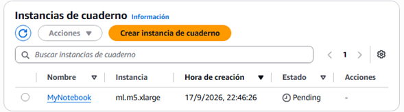

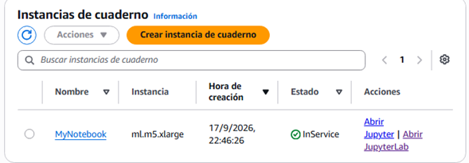

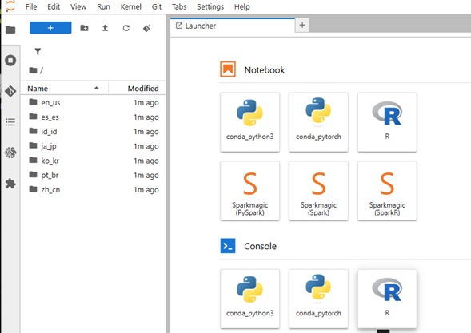

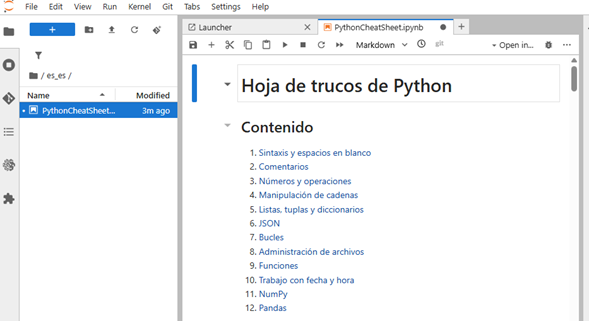

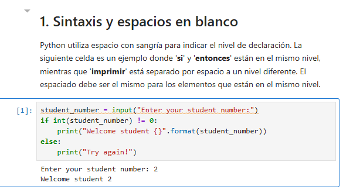

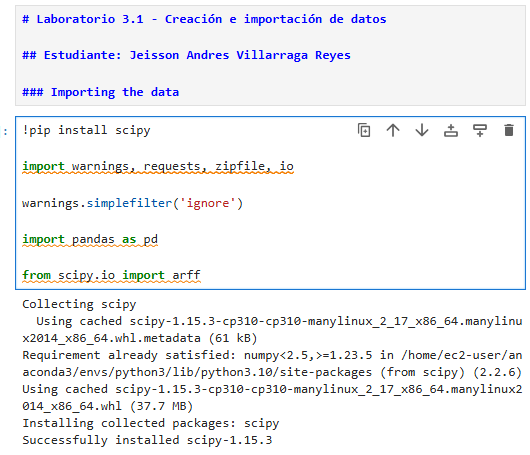

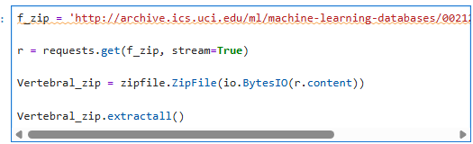

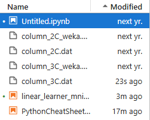

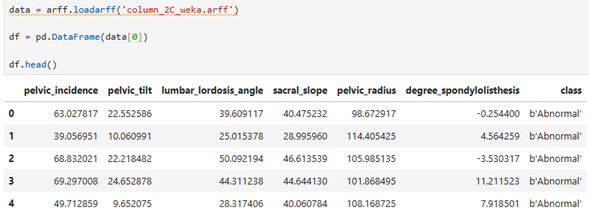

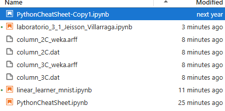

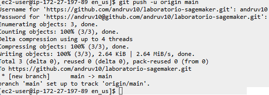

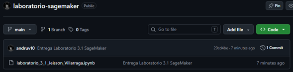

---

## Laboratorio 3.2 - Exploración de datos

En este laboratorio se realizó un análisis exploratorio de un conjunto de datos de vehículos.

Se revisó la estructura de los datos, los tipos de variables y las estadísticas descriptivas. También se utilizaron gráficos para analizar la distribución de los datos y las relaciones entre diferentes variables.

Para el análisis se utilizaron Pandas, Matplotlib y Seaborn.

**Notebook:** `3_2-machinelearning.ipynb`

### Evidencias

A continuación se presentan las capturas correspondientes al desarrollo del laboratorio:

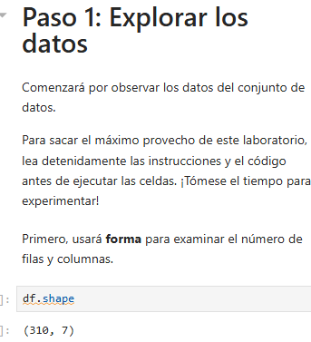

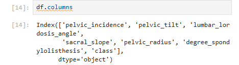

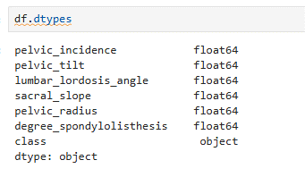

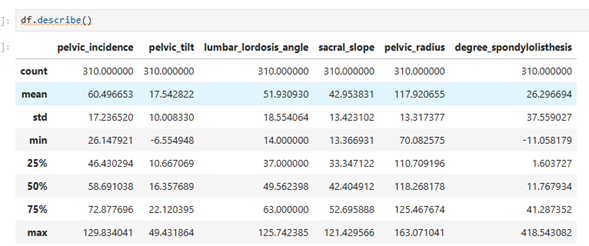

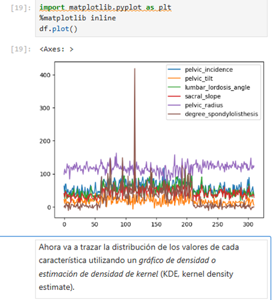

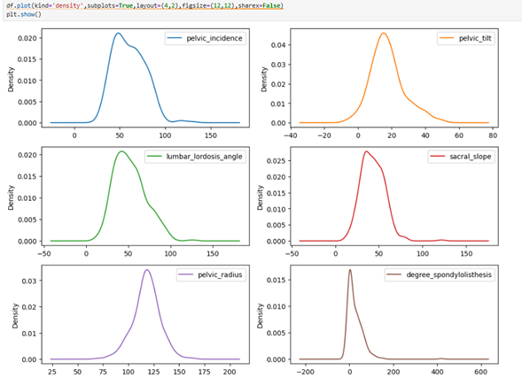

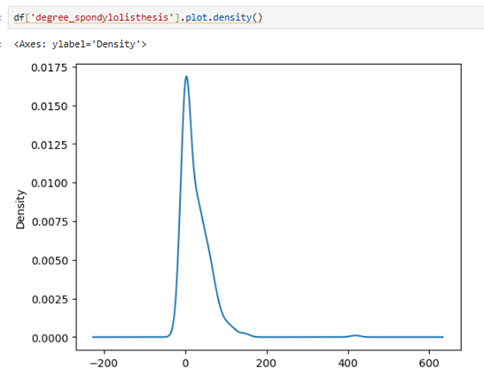

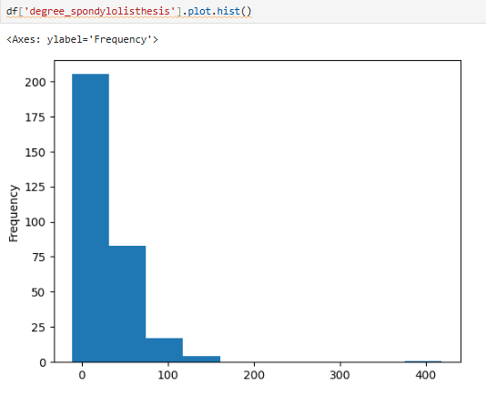

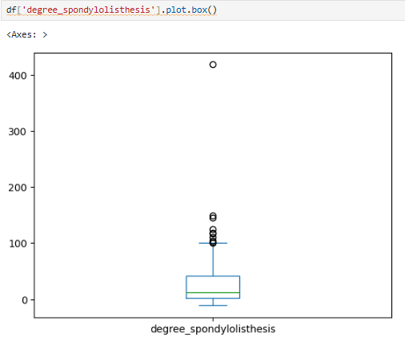

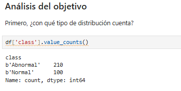

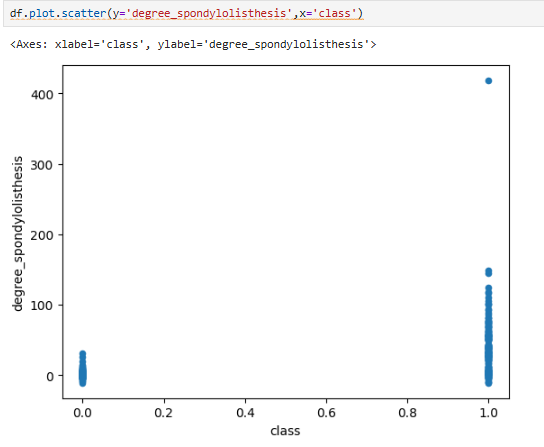

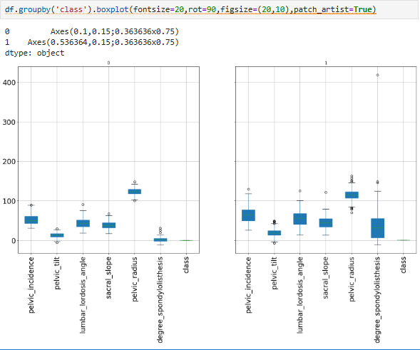

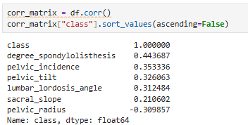

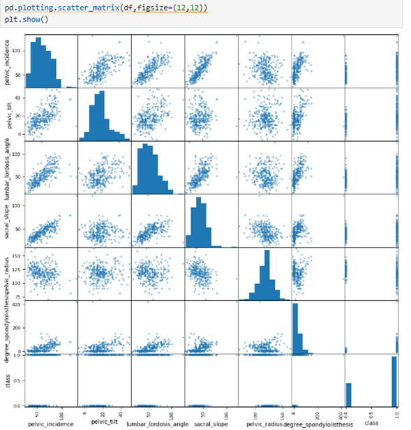

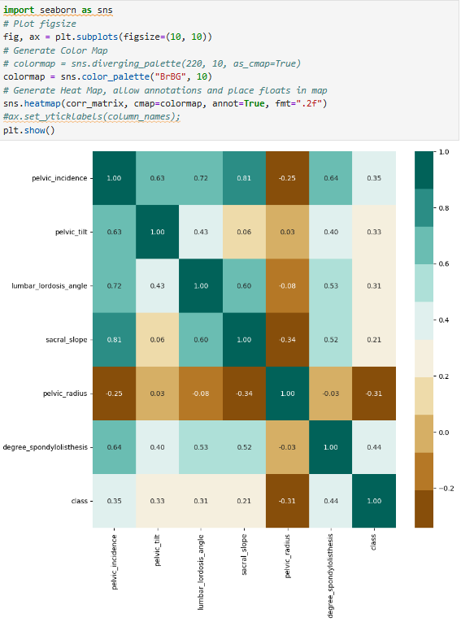

---

## Laboratorio 3.3 - Encoding de variables categóricas

En este laboratorio se trabajó con variables categóricas de un conjunto de datos de vehículos.

Se realizaron transformaciones de variables ordinales utilizando valores numéricos y se aplicaron variables dummy para representar variables categóricas no ordinales.

También se revisaron los resultados de las transformaciones realizadas.

**Notebook:** `3_3-machinelearning.ipynb`

### Evidencias

A continuación se presentan las capturas correspondientes al desarrollo del laboratorio:

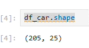

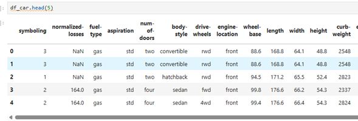

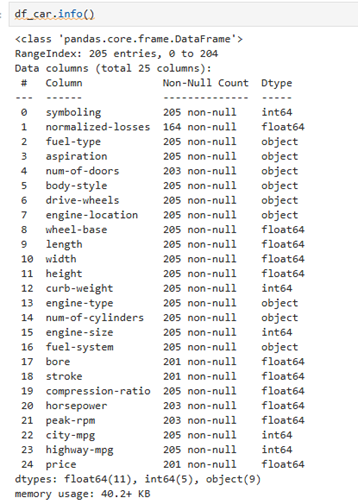

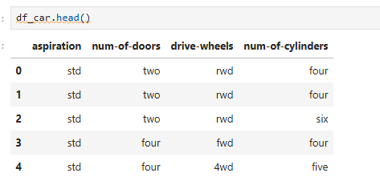

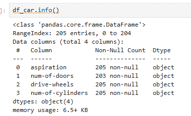

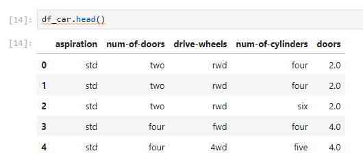

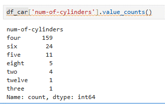

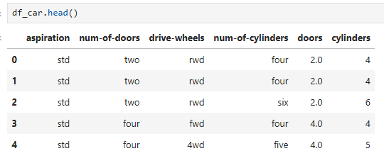

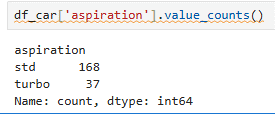

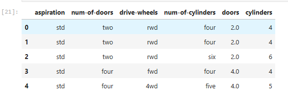

---

## Gestión del repositorio

Los notebooks fueron desarrollados en el entorno de AWS SageMaker y posteriormente gestionados mediante Git y GitHub.

Cada laboratorio cuenta con su notebook correspondiente y sus evidencias de ejecución. El repositorio permite conservar el trabajo realizado y comprobar el desarrollo de las actividades.

## Conclusión

Los laboratorios permitieron familiarizarme con el entorno de AWS SageMaker y con el uso de notebooks para trabajar con datos.

También se reforzó el uso de Python y de librerías como Pandas, Matplotlib y Seaborn para importar, explorar, visualizar y transformar información.

Finalmente, se practicó el uso de Git y GitHub para llevar un control del trabajo realizado durante los laboratorios.
